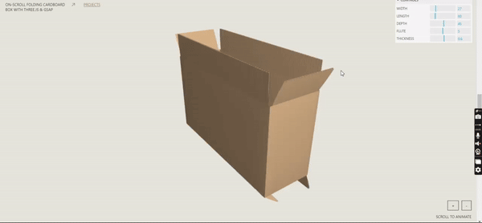

# folding_cardboard_threejs

3D cardboard box that folds and unfolds on scroll using Three.js and the GSAP Scroll Trigger.

# On-Scroll Folding Cardboard Box

Demo for the 3D cardboard box that folds and unfolds on scroll using Three.js and the GSAP ScrollTrigger.

## Installation

No package manager / build system is needed.
You can run the page as it is on local server (any web server, really).

The page is using the following libs:

1) GSAP and their scrollTrigger plugin.
Both are added as CDN, but you can turn it to JS module or NPM if needed:
<https://greensock.com/docs/v3/Installation?checked=core,scrollTrigger>

2) Three.js + their addons OrbitControls and mergeBufferGeometries.
Both are added as CDN with import map, it can also be changed:
<https://threejs.org/docs/#manual/en/introduction/Installation>

3) lil-gui controls added in the same way as threejs addons
<https://github.com/georgealways/lil-gui>

## License

[MIT](LICENSE)
